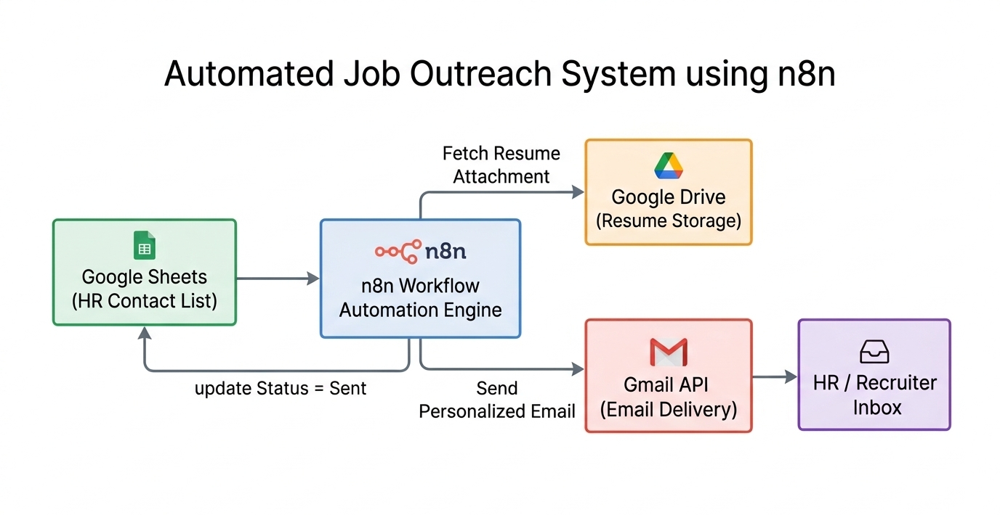
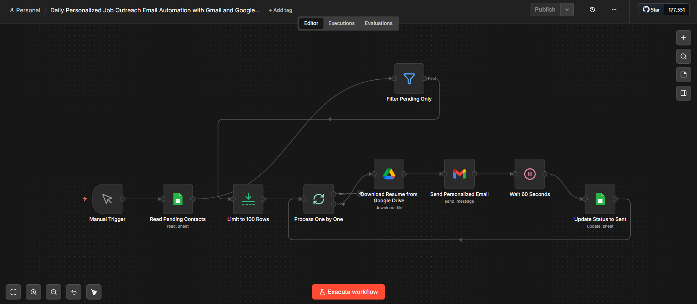
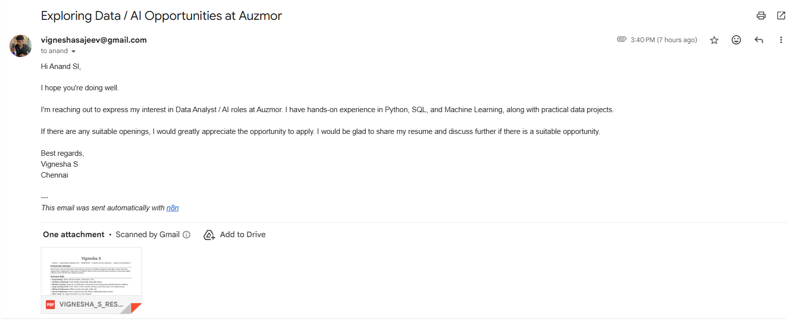
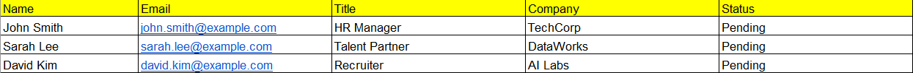

# Automated Job Outreach System (n8n)

A workflow automation system that sends personalized job outreach emails to HR contacts using Google Sheets, Gmail, and Google Drive through n8n.

This project automates cold email outreach while preventing duplicate messages and respecting safe email sending limits.

---

## Problem

Job seekers often need to send hundreds of outreach emails to recruiters or HR professionals.  
Manually sending these emails is repetitive, time-consuming, and prone to mistakes.

This project automates the outreach process using a workflow automation pipeline.

---

## Solution

The system uses **n8n workflow automation** to:

1. Read HR contact data from Google Sheets
2. Filter contacts where **Status = Pending**
3. Send personalized emails using Gmail
4. Attach resume automatically from Google Drive
5. Wait between emails to avoid spam detection
6. Update the contact status to **Sent**

---

## System Architecture



---

## Workflow Overview

### n8n Workflow


---

## Example Outputs

### Sample Email Sent


### Contact Sheet Structure


---

## Technologies Used

- **n8n** (Workflow Automation)
- **Google Sheets API**
- **Gmail API**
- **Google Drive API**
- **OAuth2 Authentication**
- **Docker / Local n8n Environment**

---

## Key Features

### Automated Email Personalization

Emails are dynamically generated using data from Google Sheets.

Example:


```

Hi {{Name}},
I’m reaching out regarding opportunities at {{Company}}.

```

---

### Duplicate Email Prevention

Emails are sent only when:

```

Status = Pending

```

After sending, the workflow updates the row to:

```

Status = Sent

```

This prevents duplicate outreach.

---

### Email Rate Limiting

To avoid Gmail spam detection and sending limits, the workflow waits:

```

60 seconds between emails

```

---

### Automated Resume Attachment

The system automatically downloads a resume from Google Drive and attaches it to each email before sending.

---

## Repository Structure

```

job-outreach-automation-n8n
│
├── README.md
├── workflow.json
├── architecture.png
├── sample_contacts_sheet.csv
│
└── screenshots
├── workflow.png
├── email_example.png
└── sheet_example.png

```

---

## Sample Data

This repository includes a **sample contact sheet with placeholder data** to demonstrate the workflow structure.

Real contact information used in the automation is not included to protect privacy.

---

## How to Use

1. Import `workflow.json` into your n8n instance.
2. Connect your credentials for:
   - Gmail
   - Google Sheets
   - Google Drive
3. Prepare a contact sheet following the structure in `sample_contacts_sheet.csv`.
4. Run the workflow manually to start sending personalized outreach emails.

---

## Future Improvements

- Randomized subject lines
- Email open tracking
- AI-generated personalized messages
- CRM integration
- Automated follow-up emails

---

## Author

**Vignesha S**  
Data Analyst | AI & Automation Enthusiast
